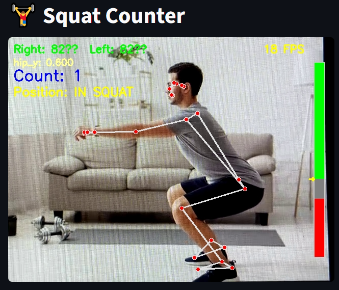

# 🏋️ Squat Counter

<p align="center">
  
</p>

_This project was developed as part of a university assignment. The objective was to create a squat counter using human pose estimation with Mediapipe and display the results via a Streamlit interface._

The exercise was given by **Ilyes Talbi**, with the following instructions:

> *“Build a squat counter using human pose estimation. Use Mediapipe to extract joint positions, compute angles and distances to detect squats, and display everything using a Streamlit UI.”*

---

## Features

- 📹 Real-time squat detection from webcam
- 🧠 Angle and hip position analysis
- 📊 Visual gauge showing pose state
- 🖼️ Streamlit UI :)))

## How to Run

```bash
git clone https://github.com/alexyvanot/squat-counter-ia.git && cd squat-counter-ia
pip install -r requirements.txt
streamlit run main.py
```

if it doesn't work, try to create a virtual environment as follows:

```bash
python -m venv .venv
source .venv/bin/activate  # On Windows use: "source .venv\Scripts\activate"
pip install -r requirements.txt
streamlit run main.py
```

# Configuration

You can adjust the squat detection thresholds in `src/squat_counter/init/config_init.py`:

```python
# Note that the more angle value is low, the more your knees are bent.
SQUAT_THRESHOLD = 100 # Minimum angle to consider a squat (for both knees)
STAND_THRESHOLD = 150 # Maximum angle to consider standing (for both knees)

# Note that the more hip value is high, the more your hips is near to the ground.
# So, a low value means you are standing, and a high value means you are squatting.
SQUAT_HIP_MIN = 0.70 # Minimum hip distance to consider a squat
STAND_HIP_MAX = 0.60 # Maximum hip distance to consider standing
```

> Note that these values are in pixels, so you may need to adjust them based on your webcam resolution and distance from the camera.

# Usage

1. Run the application with `streamlit run main.py`
2. Allow webcam access when prompted
3. Start squatting! The app will count your squats and display the current squat state (squatting or standing) along with the angle of your hips.
4. Use the visual gauge to see your squat position in real-time (green for standing, red for squatting, you can adjust the thresholds in the config file as mentioned above `src/squat_counter/init/config_init.py`).

## Requirements

- [mediapipe](https://github.com/google-ai-edge/mediapipe)
- [opencv-python](https://pypi.org/project/opencv-python/)
- [streamlit](https://streamlit.io/)
- [numpy](https://numpy.org/)

# Contributing
If you want to contribute to this project, feel free to fork the repository and submit a pull request. Any improvements or bug fixes are welcome!

# License
This project is licensed under the MIT License. See the [LICENSE](LICENSE) file for details.
